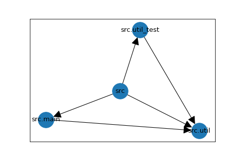
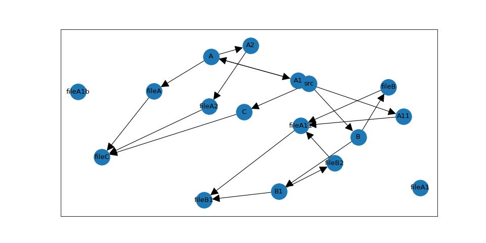

# Details

## General Concept
PyTestArch creates an Abstract Syntax Tree for each Python file it scans. It then extracts only the information about 
module imports from the AST and converts them to an internal representation. This is currently a graph supplied by the 
[NetworkX](https://networkx.org/) library.

When the user defines a rule and evaluates the internal representation against it, the rule is converted into a set of
graph operations that are then carried out on the previously generated graph.


## Simple Example

### Parsing all files
Consider the following project structure:
```
my_project/
    src/
        main.py
        util.py
        util_test.py
```

Both `main.py` and `util_test.py` are importing a util function defined in `util.py`; no other imports exist.

With "my_project" as the project's root folder and "src" as the folder to evaluate, this will create the following graph:



Each module has a direct path to all submodules, in this case: "src" is connected to all three modules it contains, 
"src.main", "src.util", and "src.util_test".

In addition, a module that imports another module has a directed edge linking it to this module. For example, "src.main"
imports "src.util" and therefore the graph has an edge connecting these modules, with the arrow head pointing at the imported
module, in this case "src.util".

### Excluding some files

In the example above, the `util_test.py` file is included in the graph and will be considered when evaluating the architecture.
If certain files should be excluded from the analysis, this can be done by specifying an exclusion pattern. In our example,
if we want to exclude `util_test.py`, we could use:
```
from pytestarch.pytestarch import get_evaluable_architecture

evaluable = get_evaluable_architecture("/home/my_project", "/home/my_project/src", ("*_test.py"))
```
This will exclude all files with names ending in "_test.py". It is also possible to exclude directories.


## More complex example
As a basis for describing the query language, let's consider a more complex example:
```
/test_project
    /src
       __init__.py
       /A
            __init__.py
            fileA.py
            /A1
                __init__.py
                fileA1.py
                fileA1_b.py
                /A11
                    __init__.py
                    fileA11.py
            /A2
                __init__.py
                fileA2.py
       /B
            __init__.py
            fileB.py
            /B1
                __init__.py
                fileB1.py
                fileB2.py
       /C 
            __init__.py
            fileC.py
```

With the following list of imports:
<ul>
    <li>fileA imports fileC</li>
    <li>fileA11 imports fileB1</li>
    <li>fileA2 imports fileC</li>
    <li>fileB imports fileA11</li>
    <li>fileB2 imports fileA11</li>
    <li>fileC imports the built-in os module</li>
</ul>

This creates the following graph (excluding all `__init__.py`):



Note that the module names in the diagram have been abbreviated: For example, the node "fileA" is actually named "src.A.fileA".

Most of the edges in this graph are due to parent-child relationships between the modules. However, five of the six import
relationships defined above are present in the graph - only fileC has no connection to an "os" node; in fact, there is no
node names "os" at all.

This has been achieved by setting the `exclude_external_libraries` flag in the `get_evaluable_architecture` function. All modules that 
not located hierarchically below the root path, in this case "test_project", will be excluded from the graph.


## Query Language

### General Structure

The query language that can be used to define architectural rules follows this structure: 

RULE_SUBJECT - VERB_MARKER_1 - IMPORT_TYPE - VERB_MARKER_2 - RULE_OBJECT

The meaning of these structural markers is described in the table below.

| Marker       | Description                                            | Example                            |
|--------------|--------------------------------------------------------|------------------------------------|
| RULE_SUBJECT | module(s) to be checked                                | modules that are named 'B'         |
| RULE_OBJECT  | module(s) to check against                             | modules that are submodules of 'A' |
| IMPORT_TYPE | expected type of import relationship | be imported by                     |
| VERB_MARKER_1 | defines the expected behavior, part I                  | should not                         |
| VERB_MARKER_2 | defines the expected behavior, part II                 | except                             |

The examples given in the table above combined form the rule `modules that are named 'B' (RULE_SUBJECT) should not (VERB_MARKER_1) be imported by (IMPORT_TYPE) modules except (VERB_MARKER_2) modules that are submodules of "A" (RULE_OBJECT)`.

Looking at the diagram in the section Complex Example, we can see that this rule holds - the only module importing 
from the "B" module is "fileA11", which is a submodule of "A".


### Features

Currently, the following markers are supported by PyTestArch:

#### RULE_SUBJECT
* are_named("X"): applies to module named "X" (and also to its submodules)
* are_submodules_of("Y"): applies to submodules of module named "Y", but not "Y" itself
* have_name_containing("*Z*"): applies to modules with names containing Z. The syntax is the same as for the file exclusion mechanism

#### RULE_OBJECT
same as RULE_SUBJECT, with an additional

anything: can only be used in combination with should_not()

In order to reduce the number of possible API component combinations, this rule object has been combined with two
verbs into: `import_anything()` and `be_imported_by_anything()`. 

In addition, RULE_OBJECTS can be passed in as a list. The rule is fulfilled if it applies to all rule objects.
For example, the rule
```
modules_that()
    .are_named("1")
    .should_only()
    .be_imported_by_modules_that()
    .are_named(["2", "3"])
```
is fulfilled, it the module "1" is not imported by any module other than "2" and "3", and if both "2" and "3" do import "1".


#### VERB_MARKER_1
* should()
* should_only()
* should_not()

#### IMPORT_TYPE + VERB_MARKER_2
* import_modules_that()
* import_modules_except_modules_that()
* be_imported_by_modules_that()
* be_imported_by_modules_except_modules_that()

VERB_MARKER_2 and IMPORT_TYPE have been conflated into one expression to improve readability.

Markers from each category can be combined freely with all markers of all other categories. Example rules could be <br>
```
modules_that()
    .are_sub_modules_of("A")
    .should_only()
    .be_imported_by_modules_that()
    .are_sub_modules_of("B")
```
(True in the above example)

or <br>
```
modules_that()
    .are_named("C")
    .should_only()
    .be_imported_by_modules_that()
    .are_named("A2")
```
(False, also imported by module "A")


Most rules are so close to the English language that a detailed explanation seems unnecessary. An exception might be the
VERB_MARKER_2 "except". A combination of this VERB_MARKER_2 and every type of VERB_MARKER_1 and IMPORT_TYPE is given below
as reference (M1, M2 are used as RULE_SUBJECT and RULE_OBJECT respectively; pseudo-code for brevity):

| Rule | Explanation |
| ---- | ----------- |
| M1 should import except M2 | M1 should import at least one module that isn't M2, but can also import M2|
| M1 should only import except M2| M1 should import at least one module that isn't M2 and should not import M2 |
| M1 should not import except M2| M1 should not import any module other than M2, but does not have to import M2 |
| M1 should be imported except by M2 | at least one module that isn't M2 should import M1 (M2 can import M1 as well) |
| M1 should only be imported except by M2 | at least one module that isn't M2 should import M1, and M2 cannot import M1 |
| M1 should not be imported except by M2 | no module other than M2 should import M1, but M2 does not have to import M1 |


There are two aliases to make rules easier:

* 'M1 should not import anything' is equivalent to: 'M1 should not import anything except itself' (e.g. imports between its submodules are allowed, but no other imports)
* 'M1 should not be imported by anything' is equivalent to: 'M1 should not be imported by anything except itself' (dito)


## Generating the evaluable architecture representation
When scanning and processing the requested modules, PyTestArch executes the following step:
1) Parse all files starting at the requested `module_path`. This only takes python source files into account that are not explicitly excluded.

2) Convert the generated AST into custom dependency representations. In this step, it is ensured that all internal modules (either importing or imported) receive their fully 
qualified name.

3) Generate a list of all modules that were parsed. This list is used to differentiate between external and internal dependencies (external dependencies will not have been parsed).

4) If not requested otherwise, external dependencies will be filtered out.

5) If external dependencies should be included, they will be added to the list of modules.

6) The dependency representations are converted to a graph structure.

### Visualizing architecture
The graph structure can be plotted with `evaluable_architecture.visualize()` (requires
matplotlib), which plots the dependency graph.
By default, the nodes are labeled with their module name. If a module name is long 
and/or a module has many submodules, the labels may crowd the plot. This can be 
addressed by specifying (short) aliases for the module names by using the keyword argument 
`aliases`. An alias will replace the module name in the label of the respective module
and all its submodules unless the submodule also has an alias, in that case the
submodule's alias takes priority.

#### Alias Examples:
Consider an architecture with modules `long_root_name, long_root_name.submodule,
long_root_name.submodule.sub_submodule, long_root_name.other_submodule` then the 
resulting labels for a given aliases are:


| aliases                                                    |  labels                                               |
|------------------------------------------------------------|----------------------------------------------------------------|
| `{'long_root_name': 'r'}`                                   | `r, r.submodule, r.submodule.sub_submodule, r.other_submodule` |
| `{'long_root_name': 'r', 'long_root_name.submodule': 'sub'}` | `r, sub, sub.sub_submodule, r.other_submodule`                 |

## Testing your architecture based on PlantUML component diagrams
### General
Instead of hand-crafting a number of rules, you can supply the path to a PlantUML component diagram. PyTestArch will
then parse this file and generate rules based on the connections of nodes in this diagram. Connections between two nodes
will be converted into 'should only' or 'should' import rules; the absence of a connection will be converted into
'should not' import rules. All rules are then evaluated against an Evaluable.

Currently, parent-child relationships between modules are not supported. This means that for module X and its submodule Y, an edge between them in the diagram
will be interpreted as an 'imports' relationship, not a 'submodule relationship'.

There are two options for naming the components in your diagram:

1) Use their fully qualified name, starting at the root module. For example, in the complex example above, this could be "src.A.fileA" instead of just "fileA" <br>
2) Use only the name of the module itself, for example "fileA". Then you need to supply the prefix left out in the diagrams relative to your root module. In our example,
    this would be "src.A". PyTestArch will then prefix all components in the diagram with this string. <br>


### Supported PlantUML language features
Syntactical requirements for .puml files:
* start of dependency definition needs to be tagged with @startuml
* end of dependency definition needs to be tagged with @enduml
* all text outside these tags is ignored
* component names must be enclosed in square brackets
* exception: if a component as been given an alias via `[module name] as alias`, then the alias should not be wrapped in square brackets
* dependencies must be with either -->, ->, <--, <-, -text->, or <-text-. The dependee is to be placed on the side of the arrow head, the dependor on the opposite side


## Additional Notes
### root_path vs. module_path in get_evaluable_architecture
The `root_path` should point towards the most top level module. In the example above, this would be `src` - not `test_project`,
as `test_project` is not the top level code directory.
The `module_path` is the module where the dependency scan will start. It has to be either identical to `root_path` or 
a submodule of it.


### Module names
In all rules, modules have to be referred to by their fully qualified name, meaning relative to the `root_path` - not the
`module_path`! This helps to distinguish between internal and external modules.
